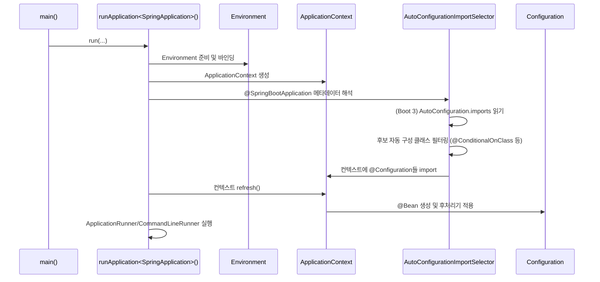

## 개요

스프링 부트(Spring Boot)는 개발자가 최소한의 설정만으로도 애플리케이션을 빠르게 만들 수 있도록 도와주는 강력한 프레임워크입니다. 이 중심에는 Auto-Configuration이라는 핵심 기능이 있습니다. 개발자가 의존성만 추가하면 알아서 필요한 빈(Bean)들을 등록해주기 때문입니다.

이 글에서는 스프링 부트가 어떻게 자동 구성 기능을 제공하는지, 그리고 그 핵심 파일인 **META-INF/spring.factories**와 스프링 부트 3에서 도입된 **META-INF/spring/org.springframework.boot.autoconfigure.AutoConfiguration.imports** 파일이 어떻게 동작하는지 한눈에 정리합니다. 이 기술의 동작 원리를 이해하면 애플리케이션의 시작 과정을 명확히 파악할 수 있으며, 복잡한 설정 문제를 해결하는 데 큰 도움이 됩니다.

-----

## 스프링 부트의 자동 구성 동작 원리

### 1\. 스프링 부트의 주요 역할

스프링 부트의 다양한 기능은 개발의 편의성을 극대화합니다. 대표적인 기능은 다음과 같습니다.

  * **자동 설정**: 클래스패스에 특정 라이브러리가 있거나, 특정 빈이 존재하면 `@Conditional` 기반으로 "적절한" 빈들을 자동으로 등록합니다.
  * **스타터와 내장 서버**: `spring-boot-starter-*` 의존성만 추가하면 톰캣(Tomcat)이나 네티(Netty) 같은 웹 런타임과 필요한 라이브러리가 한 번에 구성됩니다.
  * **통합된 외부 설정**: `application.yml`, 환경 변수, 커맨드 라인(CLI) 인자 등 다양한 설정 소스를 하나의 `Environment` 객체로 통합하여 관리합니다.
  * **런타임 훅과 모니터링**: `ApplicationRunner`, `CommandLineRunner` 같은 실행 시점 훅과 액추에이터(`Actuator`)를 통해 애플리케이션 상태와 메트릭을 제공합니다.
  * **부트스트랩 진입점**: `runApplication<SpringApplication>(...)` 메서드는 모든 자동 설정을 주입하고, 스프링 컨텍스트(ApplicationContext)를 생성하는 핵심적인 역할을 합니다.

### 2\. 애플리케이션 부팅 시퀀스(전체 흐름)

스프링 부트 애플리케이션의 부팅은 `main()` 메서드에서 `SpringApplication.run(...)`이 호출되면서 시작됩니다.  아래는 주요 단계를 나타내는 시퀀스 다이어그램입니다.

### 3\. META-INF/AutoConfiguration.imports의 역할

`META-INF/spring.factories` 파일은 스프링 프레임워크가 확장 지점들을 동적으로 로딩하는 핵심적인 메커니즘입니다. 각 라이브러리(JAR)는 이 파일에 자신만의 확장 지점 구현체 목록을 키-값 쌍으로 명시할 수 있습니다. 스프링의 `SpringFactoriesLoader`는 클래스패스 전체를 스캔하여 모든 `AutoConfiguration.imports` 파일들을 병합하고, 이 목록을 스프링 부트에 제공합니다.

| 대표 키(key) | 용도(주요 예시) |
| :--- | :--- |
| `org.springframework.boot.autoconfigure.EnableAutoConfiguration` | 설정 자동등록 켜는 Annotation입니다. |
| `org.springframework.context.ApplicationContextInitializer` | 컨텍스트 생성 직후, 리프레시(refresh) 이전에 실행되는 초기화기입니다. |
| `org.springframework.context.ApplicationListener` | 환경 준비 단계 등 초기 이벤트 리스너를 등록합니다. |
| `org.springframework.boot.env.EnvironmentPostProcessor` | `application.yml` 등 외부 설정을 읽은 직후에 환경 변수를 가공합니다. |

-----

### 4\. 자동 구성의 조건 필터링과 디버깅 방법

모든 후보 자동 구성 클래스는 즉시 활성화되지 않습니다. 각각의 클래스에는 `@Conditional` 어노테이션이 붙어 있어, 스프링 컨텍스트가 특정 조건을 만족할 때만 빈을 등록합니다.

  * `@ConditionalOnClass`: 특정 클래스가 클래스패스에 존재할 때 활성화됩니다.
  * `@ConditionalOnMissingBean`: 특정 타입의 빈이 컨텍스트에 없을 때 활성화됩니다.
  * `@ConditionalOnProperty`: 특정 프로퍼티(Property) 값이 설정되어 있을 때 활성화됩니다.

성능을 위해 빌드 시점에 생성되는 `META-INF/spring-autoconfigure-metadata.properties` 파일이 조건 힌트를 제공하기도 합니다.

**디버깅 팁**: 어떤 자동 구성이 켜졌는지 알고 싶다면, `application.yml`에 `debug: true`를 추가하여 조건 평가 리포트를 로그로 확인할 수 있습니다. 또는 액추에이터(`actuator`)를 활성화한 후 `/actuator/conditions` 엔드포인트에서 활성/비활성된 이유를 상세히 확인할 수 있습니다.

-----

## 결론

스프링 부트의 자동 구성은 `SpringApplication.run()` 메서드가 주도하는 부팅 시퀀스 안에서 **확장 지점 파일을 기반으로 동작하는 강력한 메커니즘**입니다. 이 과정은 다음과 같이 요약할 수 있습니다.

1.  `SpringApplication.run()`이 시작됩니다.
2.  `@EnableAutoConfiguration`이 읽히고, `AutoConfigurationImportSelector`가 동작합니다.
3.  스프링 부트 3에서는 **`META-INF/spring/org.springframework.boot.autoconfigure.AutoConfiguration.imports` 파일**에서 자동 구성 클래스 목록을 가져옵니다.
4.  각 자동 구성 클래스의 `@Conditional` 조건이 평가되어, 조건을 만족하는 클래스만 스프링 컨텍스트에 빈으로 등록됩니다.

이러한 동작 원리를 이해하면 스프링 부트가 어떻게 복잡한 설정을 자동으로 처리하는지 명확히 파악할 수 있으며, 커스텀 자동 구성 모듈을 개발하거나 설정 문제를 해결하는 데 큰 도움이 됩니다. 스프링 부트의 효율적인 개발 경험은 바로 이러한 내부 동작 원리 덕분입니다.
