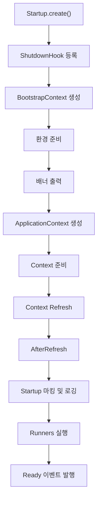

## 서론

Spring Boot 애플리케이션을 실행할 때 가장 많이 사용하는 진입점은 `runApplication<SpringBootApplication>()`입니다. 

개발자는 이를 단순히 "앱 실행 함수" 정도로 인식하는 경우가 많지만, 내부적으로는 매우 정교한 초기화 과정이 진행됩니다.

이 글에서는 Spring Boot 3 기준으로 `SpringApplication.run(...)`이 내부적으로 어떤 단계들을 거치며, 자동 구성(`@EnableAutoConfiguration`)과 어떻게 연결되는지 상세히 살펴봅니다.

---

## 본론

### 전체 실행 흐름 개요

아래 그림은 `SpringApplication.run(...)`의 주요 단계를 요약한 흐름도입니다.

이 흐름에서 핵심 포인트는 세 가지입니다.

1. 환경(Environment) 준비, 2) 애플리케이션 컨텍스트 준비, 3) 컨텍스트 리프레시입니다.

---

### 주요 단계별 상세 분석

| 단계                    | 코드/메서드                               | 설명                                                                                   |
| --------------------- | ------------------------------------ | ------------------------------------------------------------------------------------ |
| 부팅 타이밍 측정             | `Startup startup = Startup.create()` | 시작/준비/완료 구간별 시간을 기록합니다                                                               |
| Shutdown Hook         | `SpringApplication.shutdownHook...`  | JVM 종료 시 컨텍스트를 안전하게 종료하기 위해 훅을 등록합니다                                                 |
| BootstrapContext      | `createBootstrapContext()`           | 애플리케이션 컨텍스트 이전 단계의 확장 포인트를 위한 경량 컨텍스트입니다                                             |
| 환경 준비                 | `prepareEnvironment(...)`            | `application.yml`, 시스템 프로퍼티, 환경 변수, 커맨드라인 인자 등을 병합하여 `ConfigurableEnvironment`를 만듭니다 |
| 배너 출력                 | `printBanner(...)`                   | `banner.txt` 또는 커스텀 배너를 출력합니다                                                        |
| ApplicationContext 생성 | `createApplicationContext()`         | `AnnotationConfigApplicationContext` 혹은 웹 전용 컨텍스트를 생성합니다                             |
| Context 준비            | `prepareContext(...)`                | 초기화 로직, @SpringBootApplication 클래스 등록, Initializer 실행 등을 수행합니다                       |
| Context Refresh       | `refreshContext(context)`            | 스프링 표준 `refresh()` 호출로 자동 구성/빈 등록/내장 서버 기동이 일어납니다                                    |
| AfterRefresh          | `afterRefresh(...)`                  | 후처리 로직과 사용자 오버라이드 훅을 실행합니다                                                           |
| Runners 실행            | `callRunners(...)`                   | `ApplicationRunner`와 `CommandLineRunner`를 실행합니다                                      |
| Ready 이벤트             | `listeners.ready(...)`               | 컨텍스트가 완전히 실행 가능 상태임을 알립니다                                                            |

---

### AutoConfiguration 동작 원리

`@EnableAutoConfiguration`은 `@Import(AutoConfigurationImportSelector.class)`를 포함합니다.
중요한 점은 **실제 자동 구성 클래스의 해석은 `refreshContext()` 단계에서 발생**한다는 것입니다.

실행 순서는 다음과 같습니다.

1. **prepareContext 단계**

   * `@SpringBootApplication` 클래스와 메타데이터(@EnableAutoConfiguration 포함)가 컨텍스트에 등록됩니다.
   * 이 시점에는 아직 `AutoConfigurationImportSelector`가 실행되지 않습니다.

2. **refreshContext 단계**

   * `context.refresh()` → `invokeBeanFactoryPostProcessors` → `ConfigurationClassPostProcessor` 실행
   * `ConfigurationClassParser`가 @Configuration 클래스들을 해석하며 `@Import` 처리
   * 이 과정에서 `AutoConfigurationImportSelector.selectImports(...)` 호출
   * `AutoConfiguration.imports` 파일(부트 3 기준)이나 `spring.factories`(부트 2 기준)에서 자동 구성 후보를 읽어옵니다
   * `@ConditionalOnClass`, `@ConditionalOnProperty` 등 조건 애노테이션으로 필터링 후 실제 @Configuration 클래스를 import 합니다

즉, 자동 구성은 컨텍스트 리프레시 과정에서 최종적으로 컨텍스트에 편입됩니다.

---

## 결론

`runApplication<SpringBootApplication>()`은 단순한 실행 함수가 아니라, **환경 준비 → 컨텍스트 준비 → 컨텍스트 리프레시 → 자동 구성 → 런너 실행**의 복잡한 과정을 수행하는 진입점입니다.
특히 `@EnableAutoConfiguration`이 동작하는 원리는 `prepareContext`에서 단순 등록되고, `refreshContext` 과정에서 실제로 실행된다는 점을 이해하는 것이 중요합니다.

이 원리를 이해하면 다음과 같은 이점을 얻을 수 있습니다.

* 부팅 과정에서 특정 훅(리스너, Initializer)을 적절히 삽입할 수 있습니다.
* 자동 구성 동작 시점과 조건을 제어할 수 있습니다.
* 문제 발생 시 어떤 단계에서 오류가 나는지 디버깅하는 데 도움이 됩니다.
